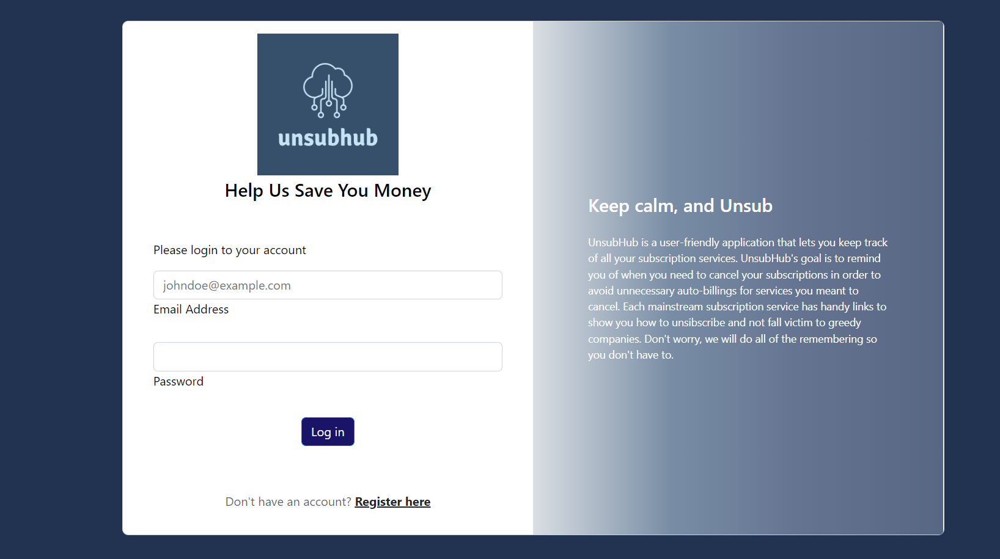
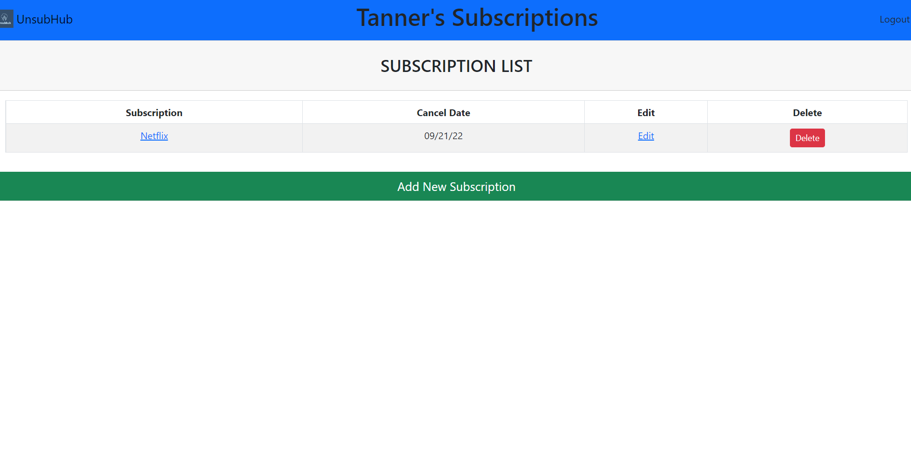
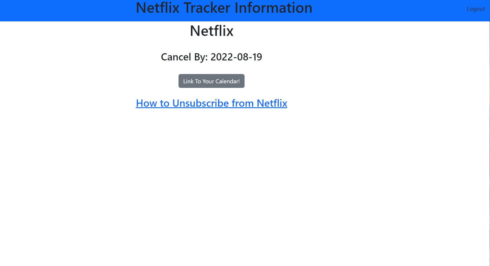

<!-- unique name -->
# UnsubHub
This will be project 2 for group10

<!-- description -->
# What does UnsubHub do?
UnsubHub is the hub to manage subscriptions you plan to cancel. 
1. The user logs in. (Figure 1)
2. The user enters subscriptions they would like to cancel by entering the Subscription name and Cancel Date.
3. The subscription displays into your hub and now you may edit, delete or create new subscriptions (Figure 2)
4. Once you click on a subscriptions, you may link it to your calendar and click on the How To Unsubscribe link when finished

<!-- technologies used -->
# Programming Languages and APIs Used
* CSS + Bootstrap
* JavaScript
* Node.js
* Express.js
* Handlebars.js
* MySQL and Sequelize
* Calendar link npm

<!-- screenshot -->
# How UnsubHub Looks
Figure 1:

Figure 2:

Figure 3:

Figure 4:

<!-- link -->
# How to Deploy UnsubHub
1. 
